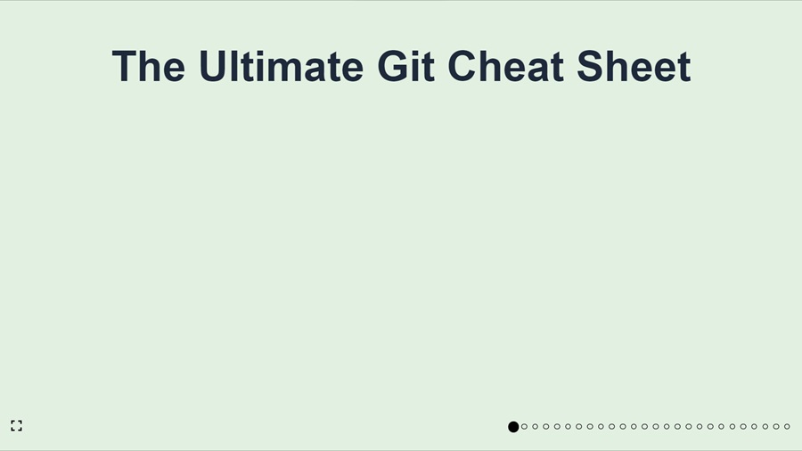

# Github bootcamp

State of progress : `102.3`

| Update dependencies | NVM Version |
|:--------------------|:------------| 
| 18 January 2023      | `20`        |



## State of progress

103.3

### 101

- [x] 01.md
- [x] 02.md
- [x] 03.md

### 102

- [x] 01.md
- [x] 02.md
- [x] 03.md
- [x] 04.md

### 103

- [x] 01.md
- [x] 02.md
- [x] 03.md
- [ ] 04.md

## Description

Multiple slides to learn more about GitHub.
Made with ❤️ and [Spectacle](https://github.com/FormidableLabs/spectacle/).

## Requirements

- [NVM](https://github.com/nvm-sh/nvm)

## Installation

To run the project, use the package manager [npm](https://www.npmjs.com/) to run it locally.
Run the command:

```
npm i
```

And build the project ;

```
npm run build
```

## How to run in local ?

Run the command:

```
npm start
```

## On the Internet?

Don't want to install the project on your computer? Just follow the link below.

🌍 [github-bootcamp](https://github-bootcamp-tan.vercel.app/)

## Author

- [**RICHIER Théo**](https://github.com/VidarDev)